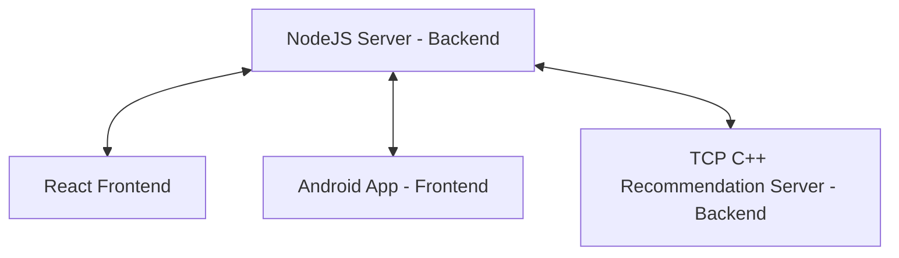

# Crispy Crumbs - TCP Recommendation Server

Welcome to the **Crispy Crumbs** TCP Recommendation Server. This server is built using C++ to handle the video recommendation functionality, providing users with personalized suggestions based on their watch history.

## Crispy Crumbs - Founders

- Ofek Avan Danan (211824727)
- Zohar Mzhen (314621806)
- Dolev Menajem (207272220)

## Setting Up the TCP Recommendation Server

### Prerequisites

This recommendations server must be activated before running the Node.js server for Crispy Crumbs. Without it, the Node.js server will display random videos instead of personalized recommendations.

- **C++ Compiler**: A C++ compiler that supports C++20 or later (e.g., GCC, Clang, MSVC). We suggest running it on WSL
- **Make** (optional): To build the server using a Makefile.

### Download

- Clone the repository from GitHub: [CrispyCrumbsTCP](https://github.com/Mzhenian/CrispyCrumbsTCP)
  ```bash
  git clone https://github.com/Mzhenian/CrispyCrumbsTCP.git
  ```

### Building the Server using Make

1. **Navigate to the Project Directory**:
   ```bash
   cd CrispyCrumbsTCP
   ```

2. **Build the Server**:
   - Use **Make test** to build the server and run it:
     ```bash
     make test
     ```
   - Alternatively, without Make using the command:
     ```bash
     g++ -std=gnu++20 -pthread -g -fdiagnostics-color=always WebServer/main.cpp recommendationEngine.cpp jsonConverter.cpp -o server.out && ./server.out
     ```

### Running the Server

After initial build, you can also run the server :

```bash
<path to project>/CrispyCrumbsTCP/server.out
```

Ensure that the server is running before starting the Node.js backend server to enable video recommendations.

### Important Notes

- The recommendations server listens for requests from the Node.js server and provides video recommendations based on user data.
- Both the recommendations server and the Node.js server must be on the same local network or properly configured to communicate.
- Keep the recommendations server running to ensure recommendations are displayed correctly in the app.

### Related Repositories

Get the full **Crispy Crumbs** experience by using the following repositories:

- [CrispyCrumbsServer (Node.js Backend)](https://github.com/Mzhenian/CrispyCrumbsServer)
- [CrispyCrumbsWeb (React Frontend)](https://github.com/Mzhenian/CrispyCrumbsWeb)
- [CrispyCrumbsAndroid (Android App)](https://github.com/Mzhenian/CrispyCrumbsAndroid)



## Recommendation Algorithm Overview

The recommendation engine in the TCP server uses a combination of user behavior and video popularity to generate personalized recommendations. Here's an overview of how the algorithm works:

**User Watch History**: The engine keeps track of the videos each user has watched and compares the user's watch history with other users' histories. It identifies videos that were watched by users who have similar watch patterns, helping to surface relevant content.

The recommendation engine handles each request from the Node.js server in real time, ensuring that the suggested videos are up-to-date with the latest trends and the user's most recent viewing habits.

## Work Process

Our team worked collaboratively to create the recommendation server. The server is designed to handle requests from the Node.js backend and respond with relevant video recommendations in real time, enhancing the user experience on Crispy Crumbs.

The journey was challenging but rewarding, as it allowed us to deepen our understanding of networking, recommendation algorithms, and cross-language integration.

- **Jira Board**:  
  [Jira project](https://crispycrumbs.atlassian.net/jira/software/projects/SCRUM/list?sortBy=customfield_10020&direction=ASC)
